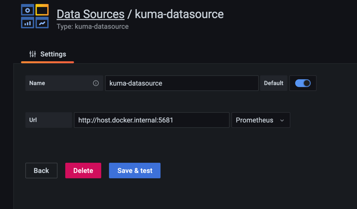

# kuma-grafana-datasource
A grafana datasource plugin for Kuma

[](https://github.com/grafana/grafana-datasource-backend/actions?query=workflow%3A%22CI%22)

This datasource will enable you to do some queries to inspect Kuma.
It also has a `mesh-graph` query type which will render a [NodeGraph panel](https://grafana.com/docs/grafana/latest/panels/visualizations/node-graph/) similar to what [Kiali](https://kiali.io) provides.

## How to install

TODO

## How to configure

It's as easy as any datasource, you can follow the instructions on the [Grafana docs](https://grafana.com/docs/grafana/latest/datasources/add-a-data-source/).

The configuration for the datasource will look like:



You'll have to set the url to your global control plane api and pick an already configured prometheus datasource in the dropdown.

Once this is done you can go in `explore` and pick the kuma-datasource with the `mesh-graph` query type:


## Future features

- Add links for logs and traces.
- Add possibility to filter services.
- Add query type for services.

File an issue if you want something :).

## Development

A data source backend plugin consists of both frontend and backend components.

The easiest way to develop is using the grafana docker image:

You can start it:

```
docker run  -p 3000:3000 -d  -e GF_DEFAULT_APP_MODE=development -v /Users/cmolter/code/kuma-datasource/dist:/var/lib/grafana/plugins --name=grafana grafana/grafana:8.0.0
```

then rebuild with:

```
mage -v && yarn dev && docker restart grafana && docker logs grafana -f
```
